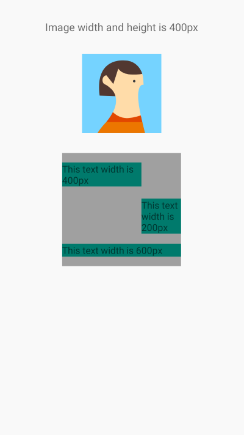
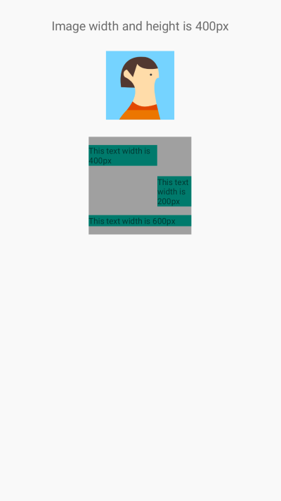
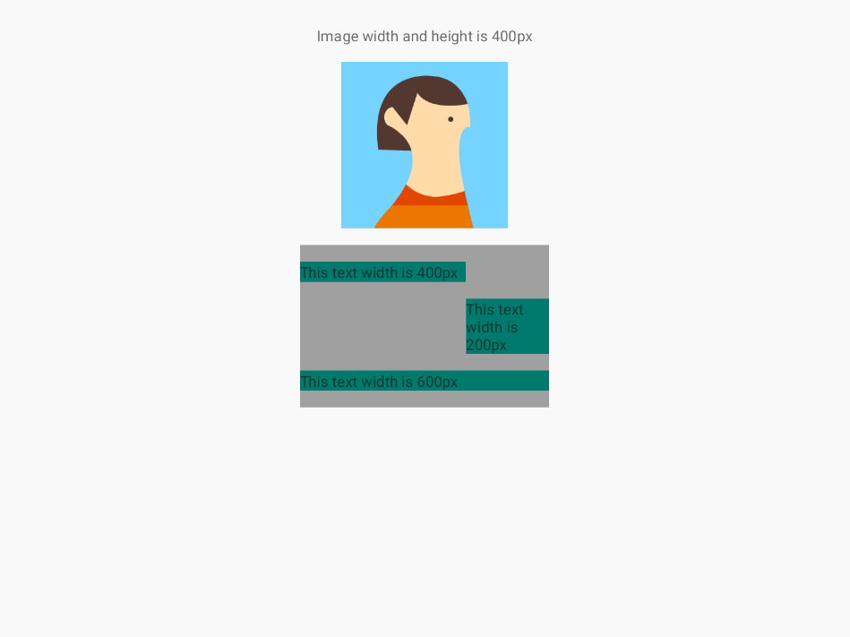
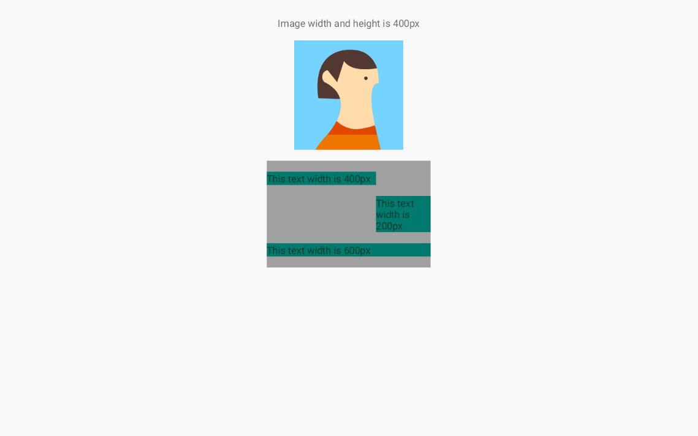
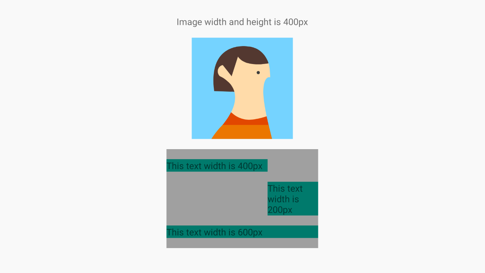

# IceDimen

## 控件按比例适配

有时候我们需要在Android到dimens资源文件中定义一个dimen声明表示一个控件
到长度或宽度，通过不同dpi的dimens资源文件的声明可以适配多种不同dpi的屏幕

IceDimen提供了已经创建好的不同dpi的dimens资源文件，这些文件种的dimen声明均采用比例缩放
可以实现当屏幕分布率不变时，在不同dpi的屏幕上显示比例相同的控件

参考比例：

|   DPI   | ldpi  | mdpi  | hdpi  | xhdpi | xxhdpi | xxxhdpi |
|:-------:|:-----:|:-----:|:-----:|:-----:|:------:|:-------:|
|   数值   |  120  |  160  |  240  |  320  |  480   |   640   |
| 缩放比例  | 0.75  |   1   |  1.5  |   2   |   3    |    4    |
| icon尺寸 | 18x18 | 24x24 | 32x32 | 48x48 | 72x72  |  96x96  |

在xml种使用：

```xml
<TextView
    android:layout_width="@dimen/dpi_120px"
    android:layout_height="@dimen/dpi_48px">
    
</TextView>
```

在代码种使用：

```
public float getWidth() {
    return getResources().getDimension(R.dimen.dpi_2160px);
}
```

## 不同分辨率尺寸下的截图

- Phone 1080p xxhdpi


- Phone 1440p xxxhdpi


- Tablet 1200x1920 xhdpi


- Tablet 2048x1536 xhdpi


- Tablet 2560x1600 xhdpi


- TV 1080p xhdpi



